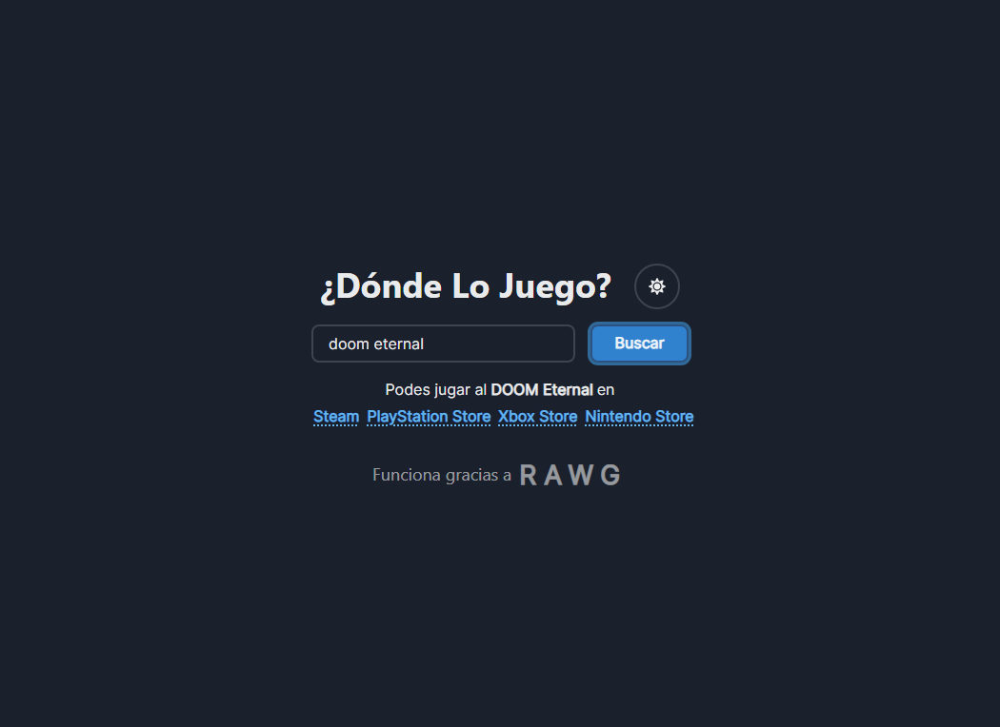

# DondeLoJuego
Es una pagina hecha con React (con Vite) y Chakra-UI inspirada en la pagina [dondelomiro.vercel.app](https://dondelomiro.vercel.app) pero para juegos.
En la misma poniendo el nombre del juego se muestra las paginas de las tiendas de distintas plataformas donde comprarlo (usando la api de RAWG)

# Deploy
[dondelojuego.netlify.app](https://dondelojuego.netlify.app)

# Ejemplo

## Api utilizada
[RAWG](https://rawg.io/apidocs)
